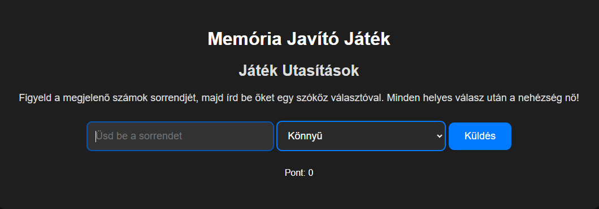

# Memory Improvement Game

## Description
The Memory Improvement Game is a simple and fun memory development game where players need to remember and input the sequence of numbers displayed. The goal is to answer as many correctly as possible to increase your score!

## Features
- **Remember Numbers**: Keep track of the order of numbers that appear during the game.
- **Difficulty Levels**: Choose between easy, medium, and hard modes.
- **Score Tracking**: The score is updated continuously for each correct answer.
- **Feedback**: Results and feedback are displayed during the game.
- **Confetti Animation**: Confetti animation appears after correct answers.

## Installation
1. Clone the repository:
   ```bash
   git clone https://github.com/DzsangaGIT/Memory-Sequence-game-with-numbers.git
   ```
2. Navigate to the folder:
   ```bash
   cd Memory-Sequence-game-with-numbers
   ```
3. Open the `index.html` file in your browser.

## Files
- **index.html**: The HTML structure of the game.
- **styles.css**: The styles defining the appearance of the game.
- **script.js**: The JavaScript code implementing the game logic.

## Usage
1. Select the difficulty level.
2. Watch the sequence of numbers displayed.
3. Type the numbers in the correct order, separated by spaces.
4. For each correct answer, the time decreases, and the game continues.
5. If you make a mistake, the game ends, and your final score is displayed.

## Screenshot



## Contributing
If you would like to contribute to the project, please open an issue or submit a pull request.

## License
This project is licensed under the MIT License. Please see the LICENSE file for details.

---

We hope you enjoy the Memory Improvement Game! If you have any questions, feel free to reach out!
